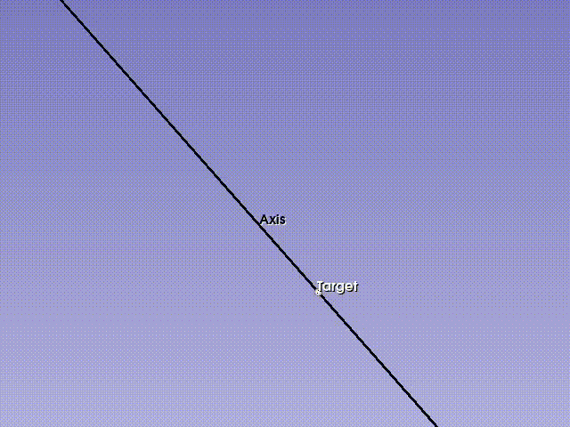

# Markup Constraints Extension

MarkupConstraints is a Slicer module to enable Slicer extension developers to constrain 
and synchronize markups and control points of different nodes. 

This extension was created during [Slicer Project Week 37][pw37] for the
[Q3DC Extension][q3dc].

See the [Architecture Overview][arch] for details on the functionality and implementation 
of this module.

See the [API Documentation][api] for details on how to consume and extend this module. 

[q3dc]: https://github.com/DCBIA-OrthoLab/Q3DCExtension
[pw37]: https://projectweek.na-mic.org/PW37_2022_Virtual/Projects/MarkupConstraints/
[arch]: ./Docs/Architecture.md
[api]: ./Docs/API.md

## Screenshots and Animations

## Build and Install

The extension is not yet available on the [Slicer Extension Index][index]. The extension 
contains only a python scripted module; refer to the [Extension Build Instructions][build]
for more details.

[index]: https://github.com/Slicer/ExtensionsIndex
[build]: https://slicer.readthedocs.io/en/latest/developer_guide/extensions.html#build-an-extension

## Scope and Limitations

The constraint system is primarily intended for refining of interactive tools, or for
deterministic relative placement of control points. As such the constraint API is only
intended to handle forward constraints, and there is not yet a mechanism for a
constraint to propagate a change to more than one point at a time.

Inverse kinematics is not in the scope of this project; it may be possible to extend the
constraint API to allow integration of an existing IK library, but there are no plans to
do so for now.

## Acknowledgements

- David Allemang (Kitware Inc.)
- Jean-Christophe Fillion-Robin (Kitware Inc.)
- Lucia Cevidanes (University of Michigan)
- Maxime Gillot (University of Michigan)
- Baptiste Baquero (University of Michigan)

Work for this project originally began for the [Q3DC Extension][q3dc]; see that extension 
for an example of usage of this module.
